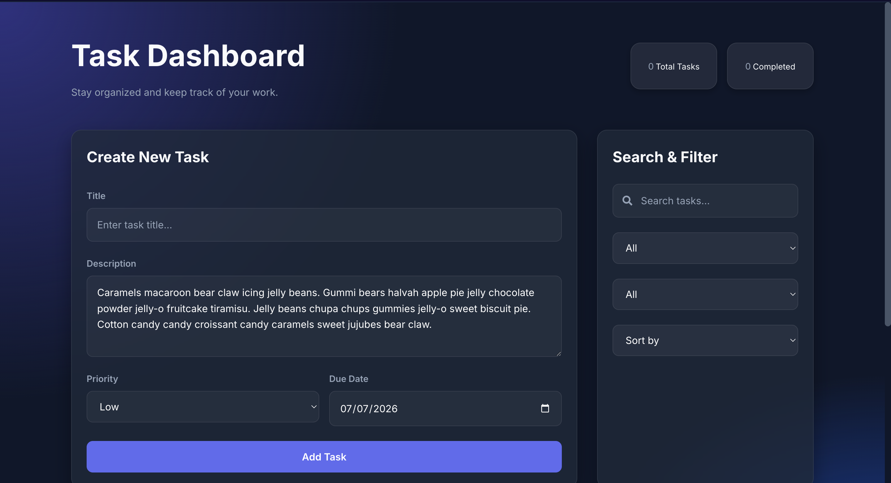
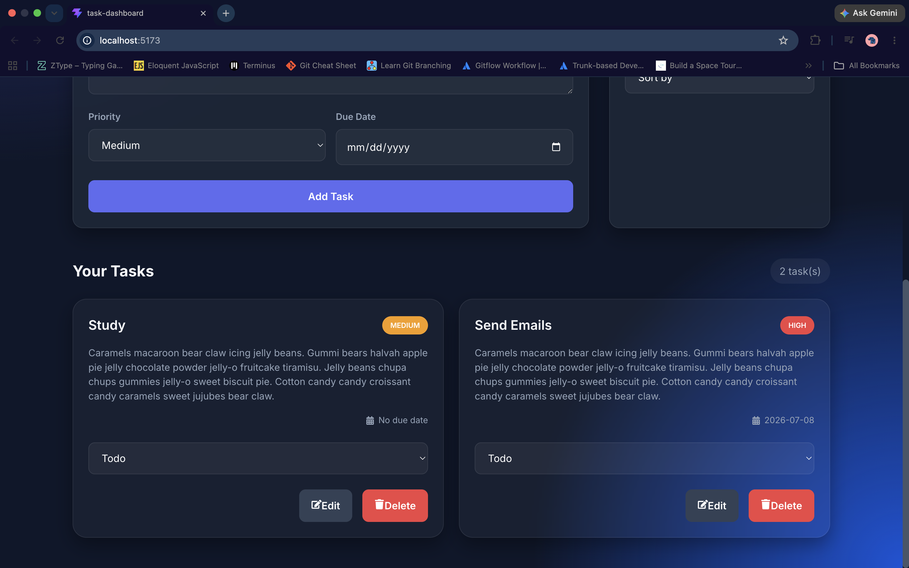
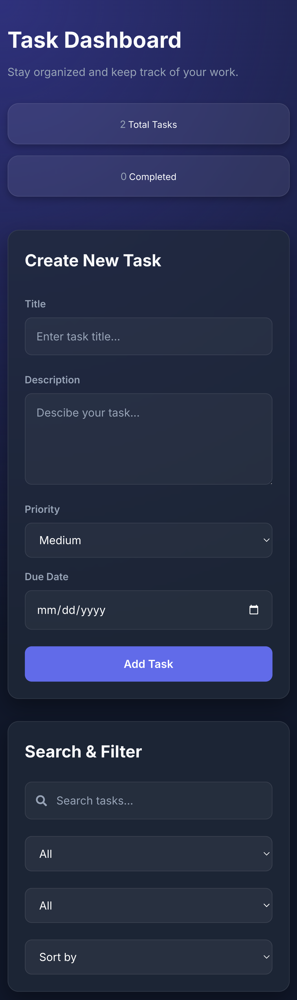
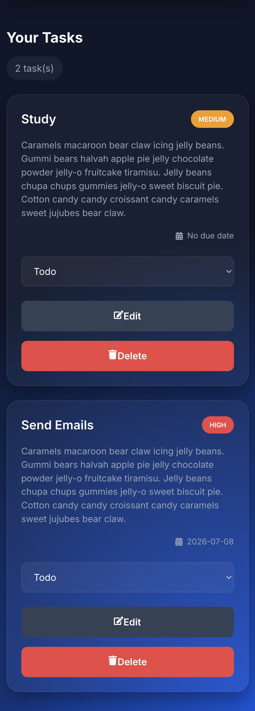

# Task Dashboard

A modern task management application built with **React** and **TypeScript** that helps users organize tasks, manage priorities, track progress, and stay productive through an intuitive dashboard interface.

---

## Features

* Create, edit, and delete tasks
* Update task status (Todo, In Progress, Done)
* Assign priority levels (Low, Medium, High)
* Set due dates
* Search tasks by title
* Filter by status and priority
* Sort by due date or priority
* Responsive dashboard layout
* Modern glassmorphism-inspired UI
* Form validation for task creation and editing

---

## Screenshots

### Dashboard

Replace this with your screenshot after adding it to the project.

```md

```
```md

```

### Mobile View

```md

```

---

## Built With

* React
* TypeScript
* CSS3
* Vite
* React Hooks (`useState`, `useEffect`)
* Component-Based Architecture

---

## Project Structure

```text
src
├── components
│   ├── Dashboard
│   ├── TaskFilter
│   ├── TaskForm
│   ├── TaskItem
│   └── TaskList
├── styles
│   ├── global.css
│   ├── Dashboard.css
│   ├── TaskForm.css
│   ├── TaskFilter.css
│   ├── TaskList.css
│   └── TaskItem.css
├── types
├── utils
└── main.tsx
```

---

## Getting Started

### Clone the repository

```bash
git clone https://github.com/YOUR_USERNAME/task-dashboard.git
```

### Navigate to the project

```bash
cd task-dashboard
```

### Install dependencies

```bash
npm install
```

### Start the development server

```bash
npm run dev
```

Open your browser and visit:

```text
http://localhost:5173
```

---

## What I Learned

Building this project strengthened my understanding of:

* React component architecture
* TypeScript interfaces and type safety
* State management with React Hooks
* Form validation
* Conditional rendering
* Reusable components
* Responsive UI design
* Modern CSS layouts using Flexbox and Grid
* Building maintainable, scalable front-end applications

---

## Future Improvements

* Drag-and-drop task management
* Local storage persistence
* Dark/light theme toggle
* Task categories or tags
* Notifications
* User authentication
* Backend API integration
* Database persistence
* Kanban board view


---

## Author

**Valerie Bolden**